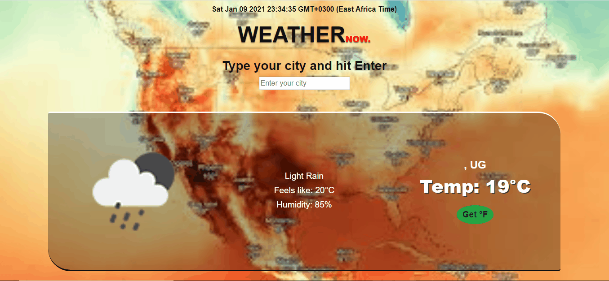

  <h1><b>Javascript Weather Application </b></h1>

A web application to provide weather details of the place entered by the user.
  

## Application Screenshot

## Content

<a text-align="center" href="#about">About</a>&nbsp;&nbsp;&nbsp;|&nbsp;&nbsp;&nbsp;
<a href="#ins">Installations</a>&nbsp;&nbsp;&nbsp;|&nbsp;&nbsp;&nbsp;
<a href="#usage">Usage</a>&nbsp;&nbsp;&nbsp;|&nbsp;&nbsp;&nbsp;
<a href="#app">App</a>&nbsp;&nbsp;&nbsp;|&nbsp;&nbsp;&nbsp;
<a href="#with">Built With</a>&nbsp;&nbsp;&nbsp;|&nbsp;&nbsp;&nbsp;
<a href="#author">Author</a>

## About 
This project was a task by [Microverse Inc.](https://www.microverse.org/) to build a web application where users can request weather information of any choice city. To achieve this, the web application in this repository makes use of the [open weather map api](https://openweathermap.org/) and ES6 features like arrow functions, both promises, and async and await for asynchronous processes. More so, webpack was used to bundle the different script files into one file for distribution.

## App Deployment
The built app is hosted on netlify  

### You may see the live version [here](https://elastic-shannon-e9e91c.netlify.app/)

## 🔧 Built with

  - [x] Javascript(ES6).
  - [x] bootstrap.
  - [x] Webpack.
  - [x] open weather map api
  - [x] geolocation api

## Usage 
To use the code in this repository, follow the steps in this section:

### 🔨 Prerequisites
 You should have the following packages installed on your computer inorder to run the code contained herein.

- Node JS 
- npm and npx

### 🔨 Setup
First get a copy of the project on your computer:

- Clone or download the repository to a local directory on your computer by following the Github instructions at [Github clone/download repository](https://docs.github.com/en/enterprise/2.13/user/articles/cloning-a-repository).

### 🛠 Installing 
Once you have a local copy of the entire project on your computer,
If you don't meet the above prerequisites, then:

- Visit [node download and installations docs](https://docs.npmjs.com/downloading-and-installing-node-js-and-npm) to install node js and npm.
- run ``npm install`` to install the project dependencies in the package.json file.

###  App 
With the installations above complete, you are set to use the code and view the application built in this repository. Follow these simple steps:

- Change directory into the directory where you cloned the repository. 
- Then run ``cd js-weather-app`` to access the project directory.
- Open the project directory in your editor of choice. For example running ``code .`` will open the project in VSCode.
- Run ``npm start`` to start webpack-dev-server.
- If everything worked well, the browser should automatically render the weather application on localhost:8080.

## ✒️  Author 

👤 **Mworekwa Ezekiel**

- Github: [@vanheaven-ui](https://github.com/vanheaven-ui)
- Twitter: [@MworekwaE](https://twitter.com/MworekwaE)
- Linkedin: [@linkedin](https://www.linkedin.com/in/vanheaven/)
- Email: [ezekiel](mailto:vanheaven6@gmail.com)

## 🤝 Contributing

Contributions, issues and feature requests are welcome!

- To create an issue, visit the [issues page](https://github.com/vanheaven-ui/events/issues) and create a new issue.
- To contribute to the code base, follow the steps below:
  1. Fork this repository to your remote respository by clicking the Fork button in this repository.
  2. Clone this repository to a directory on your computer by following Github guidelines.
  3. Change directory into the directory where you cloned this repository to.
  4. Open the directory using your favorite editor.
  5. Create a feature branch off the develop branch.
  5. Make and commit the nuanced code.
  6. Open a pull request describing the improvements made
And your reward awaits in heaven.

## 👍 Show your support

Give a ⭐️ if you like this project!

## :clap: Acknowledgements
- [Microverse community](https://www.microverse.org/)  
- [The Odin Project specifications](https://www.theodinproject.com/courses/javascript/lessons/weather-app)
